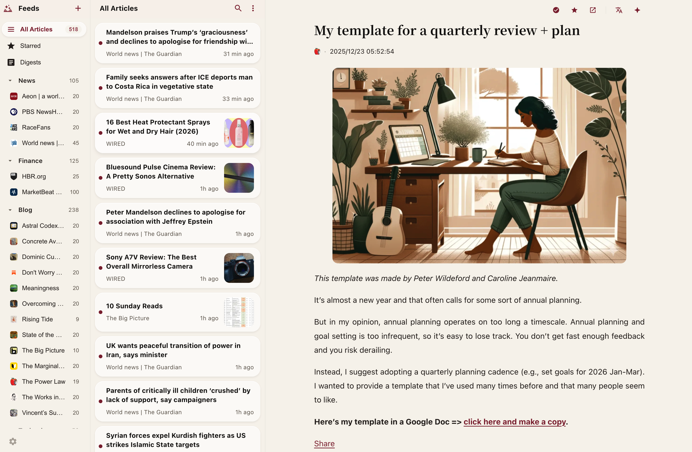
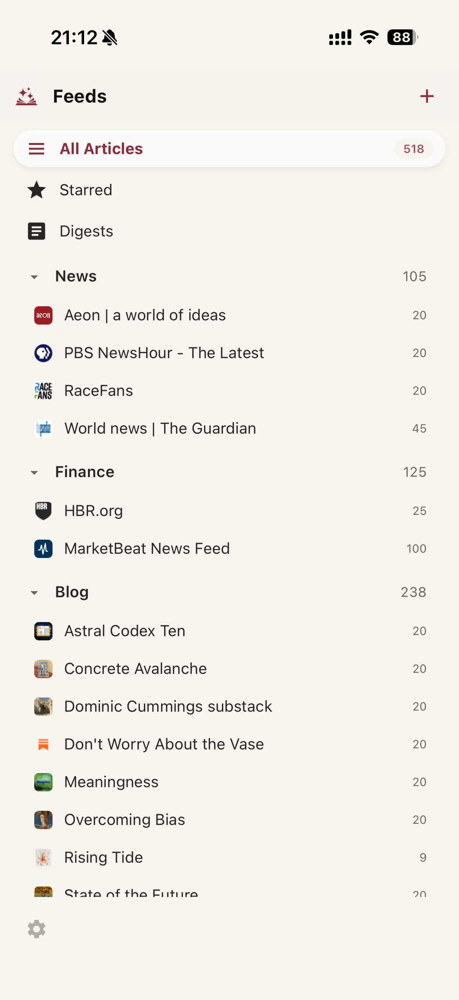
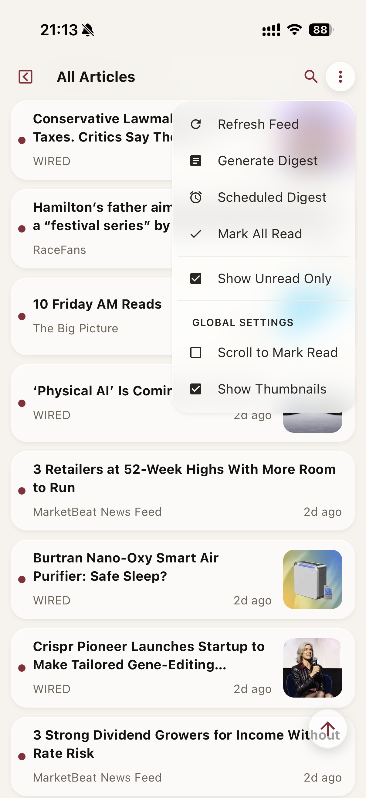
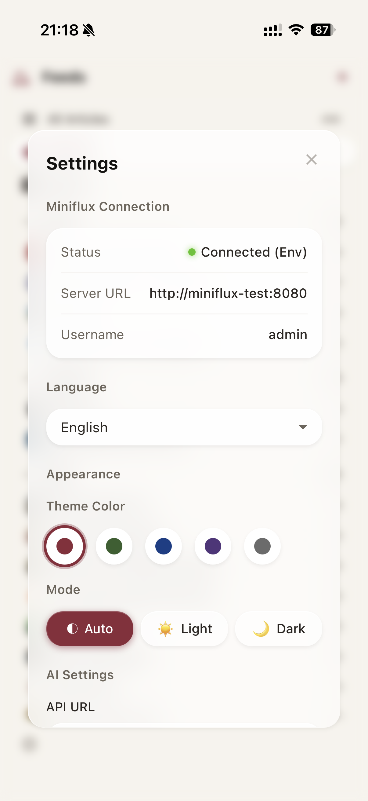
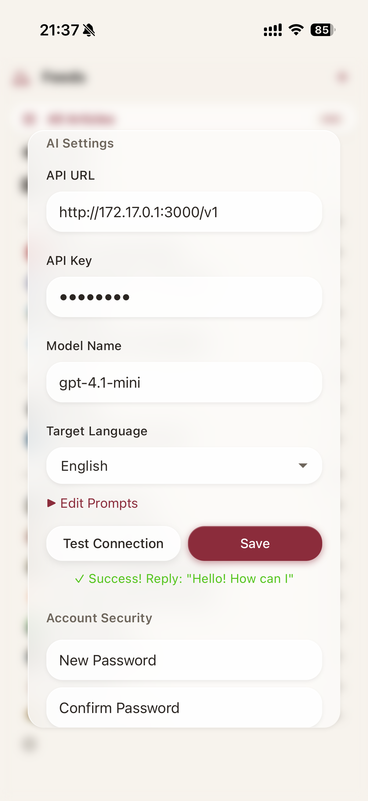

# Tidyflux

<p align="center">
  一个基于 Miniflux API 开发的简洁美观的网页客户端
</p>

> ⚠️ **说明**：此版本基于原 [TidyFlux](https://github.com/PehZeroV/tidyflux) 仓库二次开发，已进行了大量功能增强与优化（含AI标题翻译、全新的摘要调度机制、更完善的移动端适配等）。

> 👋 **写在前面**：我是个**完全不懂代码的小白**，这个项目是**完全靠 Google Antigravity 写出来的**。特别感谢 AI 的强大能力，让想象力不再受限于代码能力。期待未来 AI 能帮助更多普通人实现自己的一个个小想法！🚀

[English](README_EN.md)

## 截图

### 桌面版



### 手机版

<div align="center">
  
  
  
</div>
<div align="center">
  
  
  
</div>

## 功能

- 🎨 现代化三栏布局，支持深色模式
- 📱 支持手机、平板、电脑
- 🌐 中英文双语界面
- 📥 可安装到桌面（PWA）
- ⌨️ 快捷键支持：内置丰富快捷键操作，支持自定义按键
- 💾 保存到第三方服务：支持将文章保存到 Pocket、Instapaper、Wallabag 等第三方服务
- 🎧 内置播客播放器，支持后台播放和进度控制
- 🔄 个性化设置和 AI 配置云端存储，多设备自动同步
- 🤖 **AI 增强功能**：
  - 📝 **文章总结**：一键提取文章核心观点和摘要
  - 🌍 **全文翻译**：支持多种语言的全文翻译
  - 📅 **智能简报**：支持手动或定时生成每日内容简报，支持 Webhook 推送（钉钉、企业微信、飞书等）
  - ⚙️ **自定义 AI 接口**：支持所有兼容 OpenAI 格式的 API

### 支持的操作

**订阅源**：添加、编辑、删除、刷新、OPML 导入导出

**文章**：阅读、搜索、标记已读/未读、收藏、获取全文、保存到第三方服务

**分组**：创建、重命名、删除、置顶分组

## 前置要求

需要先安装 [Miniflux](https://github.com/miniflux/v2)，本项目是 Miniflux 的网页客户端。

## 快速开始

### 一、已有 Miniflux，单独部署 Tidyflux

**方法 1：命令行一键启动**

```bash
docker run -d --name tidyflux --restart unless-stopped -p 8812:8812 -e TZ=Asia/Shanghai -v tidyflux_data:/app/server/data pehzerov/tidyflux:latest
```

启动后访问 `http://localhost:8812`，按提示填写你的 Miniflux 地址、用户名和密码即可。

**方法 2：Docker Compose (推荐)**

1. 下载配置文件：

```bash
curl -O https://raw.githubusercontent.com/PehZeroV/tidyflux/main/docker-compose.yml
```

2. 编辑 `docker-compose.yml` 配置自动登录（可选）：

```yaml
environment:
  - TZ=Asia/Shanghai
  - MINIFLUX_URL=https://你的miniflux地址
  - MINIFLUX_API_KEY=你的miniflux_api_key # 优先推荐
  # 或者使用用户名密码：
  # - MINIFLUX_USERNAME=Miniflux用户名
  # - MINIFLUX_PASSWORD=Miniflux密码
```

3. 启动服务：

```bash
docker compose up -d
```

> 💡 **提示**：如果你使用简报定时生成功能，请通过 `TZ` 环境变量设置正确的时区（默认为 `Asia/Shanghai`）。

**默认账号**：

- 地址: `http://localhost:8812`
- 账号: `admin`
- 密码: `admin`
- _建议登录后修改密码_

### 二、全新部署（包含 Miniflux + Tidyflux）

如果你还没有部署 Miniflux，可以通过以下步骤部署全套服务。

1. 下载全栈配置文件：

```bash
curl -o docker-compose.yml https://raw.githubusercontent.com/PehZeroV/tidyflux/main/docker-compose-with-miniflux.yml
```

> ⚠️ **重要安全提示**：
> 启动前，请务必编辑 `docker-compose.yml`，将 `ADMIN_PASSWORD` (Miniflux 密码) 和 `MINIFLUX_PASSWORD` (TidyFlux 连接密码) 修改为**相同的强密码**。

2. 启动所有服务：

```bash
docker compose up -d
```

**服务信息**：

- **TidyFlux (阅读器)**: `http://localhost:8812`
  - 账号：`admin`
  - 密码：`admin` (登录后请修改)

- **Miniflux (后台)**: `http://localhost:8080`
  - 账号：`admin`
  - 密码：你在 `yml` 文件中设置的密码
